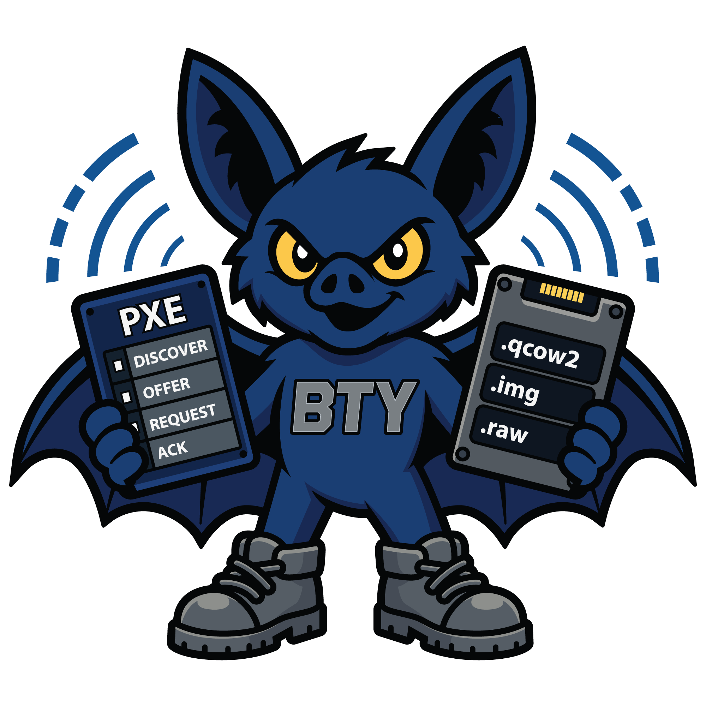

<p align="center">
  
</p>

# bty - flash images onto target disks, from local or network sources

[](https://github.com/safl/bty/actions/workflows/ci.yml)
[](https://github.com/safl/bty/actions/workflows/docs.yml)
[](https://safl.dk/bty)
[](https://pypi.org/project/bty-lab/)
[](https://pypi.org/project/bty-lab/)
[](LICENSE)

Image-flash provisioning toolkit for bare-metal and virtual targets.
Writes pre-built ("cooked") system images onto target disks. Three
delivery shapes from the same runtime: a self-contained USB live
stick, a USB stick pulling from a network-shared image catalog, or
a PXE-boot server that flashes targets unattended. Configures the
deployed system on first boot via cloud-init or CIJOE workflows.

bty is one Python package: the `bty` module, distributed on PyPI as
[`bty-lab`](https://pypi.org/project/bty-lab/), with three
console-script entry points:

- `bty`: main CLI (image inspection, target discovery, flashing,
  provisioning).
- `bty-tui`: terminal UI (requires the `tui` extra). With
  `--server URL` it doubles as a remote-flash client against a
  running `bty-web`.
- `bty-web`: HTTP server with browser UI (requires the `web` extra).

Plus a sibling appliance-image builder under `bty-media/` that
produces four variants from a shared rootfs overlay: the bootable
USB live image (`usb-x86`), the x86 server appliance (`server-x86`),
the Raspberry Pi 4 / 5 server appliance (`server-rpi`), and the
PXE-chain network-flash live env (`netboot-x86`).

For a low-friction trial of the bty-web UI without flashing
anything, a multi-arch container is published to
[`ghcr.io/safl/bty-web`](https://github.com/safl/bty/pkgs/container/bty-web)
on every release:

```bash
docker run -d --name bty-web -p 8080:8080 -v "$PWD/bty-data":/var/lib/bty \
  ghcr.io/safl/bty-web:latest
# -> http://localhost:8080/ui   (login: bty / bty)
```

Image catalog only - no DHCP / TFTP / PXE proxy in the container
(those need bare-metal LAN access; use the appliance for that).
See [`docs/src/walkthrough-server-docker.md`](docs/src/walkthrough-server-docker.md).

## Install

```bash
pipx install bty-lab            # CLI, zero third-party Python deps
pipx install "bty-lab[tui]"     # adds the bty-tui terminal UI
pipx install "bty-lab[web]"     # adds the bty-web HTTP server
pipx install "bty-lab[all]"     # everything
```

The CLI flow (`bty list disks`, `bty inspect image`, `bty flash --dry-run`)
needs only Python 3.11+ and stdlib; full flashing (`bty flash --yes`)
relies on system binaries (`dd`, `qemu-img`, `zstd`, `lsblk`, etc.) the
operator's distribution is expected to provide.

## Status

Pre-1.0 but actively shipping. Wheels and appliance images publish
to PyPI + [GitHub Releases](https://github.com/safl/bty/releases) on
every tag, and the server + client + PXE-chain end-to-end flow runs
in CI on every push. The CLI surface (`bty list`, `bty inspect`,
`bty flash`) and the bty-web HTTP/iPXE/PAM-auth surfaces are stable
enough to use in homelab / CI fleets. Wire formats and CLI flags
may still shift between minor versions until 1.0; the schema_version
field on `--json` output and the `Machine` wire type are the things
to watch. See [`PLAN.md`](PLAN.md) for the milestone-by-milestone
roadmap.

## Planning and design

- [`PLAN.md`](PLAN.md): roadmap and design intent.
- [`docs/`](docs/): full documentation (Sphinx + MyST).

## Development

`uv` is the project's dependency manager. Install it via pipx if you
don't already have it:

```bash
pipx install uv
```

Then sync the dev environment:

```bash
uv sync --all-extras --group dev
```

Run the test suite, linter, and type-checker:

```bash
uv run pytest
uv run ruff check
uv run mypy src
```

## Documentation

The docs tooling installs as a separate pipx app:

```bash
pipx install ./docs/tooling
```

Then, from inside `docs/`:

```bash
bty-docs-serve              # live-rebuild dev server on :8000
bty-docs-build-html         # one-shot HTML build
bty-docs-build-pdf          # one-shot PDF build (requires LaTeX)
```

## License

[GPL-3.0-only](LICENSE).
